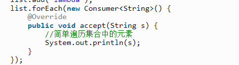

# LeeCodeNote


```java
class Solution {
    public int myAtoi(String s) {
        //找到开头的元素，可能找不到。
        int beginPos=0,i;
        for(i=0; i<s.length(); i++) {
            if(s.charAt(i) != ' ') {
                beginPos=i;
                break;
            }
        }
        if(i==s.length())
            return 0; //找不到就是0
        //确定符号
        int sign;
        if(s.charAt(beginPos)=='+'){
            sign=1;beginPos++;
        }else if(s.charAt(beginPos)=='-'){
            sign=-1; beginPos++;
        }
        else{
            sign=1;
        }
        //
        long ans=0;
        for(i=beginPos; i<s.length(); i++) {
            if(s.charAt(i)<'0'||s.charAt(i)>'9')
             break;
             ans=ans*10+s.charAt(i)-'0';
             if(ans-1>Integer.MAX_VALUE)
             break;
        }
        ans=sign*ans;
        if(ans>Integer.MAX_VALUE&&sign==1)
        {
            return Integer.MAX_VALUE;
        }else if(ans<Integer.MIN_VALUE&&sign==-1)
        {
            return Integer.MIN_VALUE;
        }
        return (int)ans;
    }
}
```

涉及复杂的流程以及条件情况，容易写出错误代码。使用自动机概念，每次获取数据，实现状态的改变，为每个状态写一个子函数。


## [23. 合并K个升序链表 - 力扣（LeetCode）](https://leetcode.cn/problems/merge-k-sorted-lists/)

```java
class Solution {
    public ListNode mergeKLists(ListNode[] lists) {
        //链表接到一起
        if(lists.length==0)
            return null;
        //多次遍历，把每次最小的遍历到上面
        ListNode ansHeader=new ListNode(0,null);
        ListNode ansTailer=ansHeader;
        while(true){
            int minNum=Integer.MAX_VALUE;          
            for(var list:lists){
                if(list==null)
                    continue;
                minNum=Math.min(list.val, minNum);
            }
			//设置一个很大的值也可以
            if(minNum==Integer.MAX_VALUE)//全都null
                break;
            for(int i=0;i<lists.length;i++){
                 if(lists[i]==null)
                    continue;
                if(lists[i].val==minNum)
                {
                    ansTailer.next=new ListNode(minNum,null);
                    ansTailer=ansTailer.next;
                    lists[i]=lists[i].next;
                }
            }
        }
                    return ansHeader.next;
    }
}
```

```java
class Solution {
    public ListNode mergeKLists(ListNode[] lists) { 
        int k = lists.length;
        ListNode dummyHead = new ListNode(0);
        ListNode tail = dummyHead;
        while (true) {
            ListNode minNode = null;
            int minPointer = -1;
            for (int i = 0; i < k; i++) {
                if (lists[i] == null) {
                    continue;
                }
                if (minNode == null || lists[i].val < minNode.val) {
                    minNode = lists[i];
                    minPointer = i;
                }
            }
            //上面是一个很好的求最小值的一个方法，先设置一个离谱的初值，然后通过第一次判断来确定。
            //可以用于最小值捆绑的时候
            if (minPointer == -1) {
                break;
            }
            tail.next = minNode;
            tail = tail.next;
            lists[minPointer] = lists[minPointer].next;
        }
        return dummyHead.next;
    }
}

```


```
java的for(var val:lists);增强for循环是引用，是把值传过去，改变val的值，不会改变lists里面的值。
```

### 优先队列[优先队列(PriorityQueue) - 简书 (jianshu.com)](https://www.jianshu.com/p/cb591a12f50c)

普通的队列是一种先进先出的数据结构，元素在队列尾追加，而从队列头删除。在优先队列中，元素被赋予优先级。当访问元素时，具有最高优先级的元素最先删除。优先队列具有最高级先出 （first in, largest out）的行为特征。通常采用堆数据结构来实现。

c++中优先队列只可以使用仿函数

**`template <class T, class Container = vector<T>, class Compare = less<typename Container::value_type> > class priority_queue;`**

```
最大优先队列：priority_queue<int> MaxHeap;

                  或：priority_queue<int，vector<int>, less<int> > MaxHeap

最小优先队列：priority_queue<int，vector<int>，greater<int> > MinHeap;
```


### 堆，优先队列就是最小堆和最大堆

堆严格意义上来说又叫二叉堆（Binary Heap），因为它的结构是一颗完全二叉树，堆一般分为最大堆和最小堆。

堆性质：
 结构性：堆是一颗除底层外被完全填满的二叉树，底层的节点从左到右填入，这样的树叫做完全二叉树。即缺失结点的部分一定再树的右下侧。

堆序性：由于我们想很快找出最小元，则最小元应该在根上，任意节点都小于它的后裔，这就是小顶堆（Min-Heap）；如果是查找最大元，则最大元应该在根上，任意节点都要大于它的后裔，这就是大顶堆(Max-heap)。

```
堆的上浮和下沉操作
```

### java的优先队列

```java
peek()//返回队首元素
poll()//返回队首元素，队首元素出队列
add()//添加元素
size()//返回队列元素个数
offer()// 是往队列中添加一个元素，若队列已满而仍往队列中添加，则会返回false
isEmpty()//判断队列是否为空，为空返回true,不空返回false
//构造方法
    Queue<ListNode>pq =new PriorityQueue<>(函数的引用);
//可以用于排序
```

### 比较器

Comparable和Comparator在java中都是用于来比较数据大小。

实现Comparable接口需要重写compareTo方法，

实现Comparator方法需要重写compare方法。

 这两个方法返回值都是int类型，根据返回值来判断比较对象的大小，从而实现排序。

### 函数引用

函数可以传给一个参数的



函数接口可以直接new后面加（）来重写

Function stringToInteger = Integer::parseInt;

### Java Lambda 表达式

```java
(parameters) -> expression[表达式]
(parameters) -> statements[语句]
(parameters) ->{ statements; }

// 1. 不需要参数,返回值为 2
()->2
// 2. 接收一个参数(数字类型),返回其2倍的值
x->2*x//表达式
// 3. 接受2个参数(数字),并返回他们的和
(x,y) -> x+y//表达式
// 4. 接收2个int型整数,返回他们的乘积
(int x,int y) -> x * y//表达式
// 5. 接受一个 string 对象,并在控制台打印,不返回任何值(看起来像是返回void)
(String s) -> System.out.print(s)语句
```

函数式接口（只要一个方法的抽象对象）可以和lambda表达式混用

```
参数类型可以省略，如果需要省略，每个参数的类型都要省略。
参数的小括号里面只有一个参数，那么小括号可以省略
如果方法体当中只有一句代码，那么大括号可以省略
如果方法体中只有一条语句，其是return语句，那么大括号可以省略，且去掉return关键字。
```

小括号和大括号和return在不影响意思的情况下都可以省略

